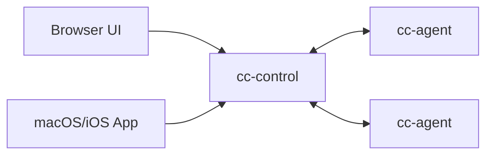

# Agent Control (AI Agent Control Plane MVP)

Multi-server control plane for AI coding runtimes (Claude Code, Codex, Gemini CLI, OpenCode).

## Layout



- `cc-control/`: control plane (`REST + WS + audit + token management + optional prompt detection`)
- `cc-agent/`: per-server agent (`WS outbound + PTY spawn/stream/input`)
- `cc-web/`: static browser UI (`xterm.js`)
- `app/AgentControlMac/`: native macOS/iOS client

## Quick Start

For production deployment (including TLS), use `docs/deploy-public-server.md`.

1. Start `cc-control` with an admin token.

```bash
cd cc-control
go run ./cmd/cc-control \
  -addr :18080 \
  -ui-dir ../cc-web \
  -admin-token admin-dev-token \
  -ui-token "" \
  -agent-token "" \
  -audit-path ./audit.jsonl \
  -offline-after-sec 30
```

2. Create tokens via web

Open `http://127.0.0.1:18080/admin` to manage tokens.

2.1 Create Tenant token (admin)

- Fill `admin token` (for example `admin-dev-token`).
- Set `token type = tenant`.
- Leave `tenant id` empty to auto-create a new tenant.
- Click `Generate Token`.
- Save the generated `token` (tenant token) and `tenant` (tenant id).

2.2 Tenant generates UI + Agent tokens

- In `Tenant Tokens`, paste the tenant token from 2.1.
- Set `ui role = owner` (or `viewer/operator` as needed).
- Optional: fill `tenant id` (must match the tenant token).
- Click `Generate UI + Agent`.
- Save the generated UI token and agent token.

2.3 Optional management

- Click `List Tokens` to view issued tokens (supports tenant filter).
- Click `Revoke` to revoke a token by `token_id`.


3. Create token via CLI.

3.1 Tenant token (admin)

```bash
# Admin: create tenant token
curl -X POST http://127.0.0.1:18080/admin/tokens \
  -H "Authorization: Bearer admin-dev-token" \
  -H "Content-Type: application/json" \
  -d '{"type":"tenant"}'
```

Example Tenant token response:

```json
{
  "created_at_ms": 1770964695390,
  "role": "",
  "tenant_id": "<tenant-a-id>",
  "token": "<tenant-a-tenant-token>",
  "token_id": "<tenant-a-tenant-token-id>",
  "type": "tenant"
}
```

3.2 Tenant UI + Agent tokens

```bash
# Tenant: create UI + Agent tokens (owner role)
curl -X POST http://127.0.0.1:18080/tenant/tokens \
  -H "Authorization: Bearer <tenant-a-tenant-token>" \
  -H "Content-Type: application/json" \
  -d '{"role":"owner"}'
```

Example Tenant token response:

```json
{
  "tenant_id": "<tenant-a-id>",
  "ui": {
    "token": "<tenant-a-ui-token>",
    "token_id": "<tenant-a-ui-token-id>",
    "role": "owner"
  },
  "agent": {
    "token": "<tenant-a-agent-token>",
    "token_id": "<tenant-a-agent-token-id>"
  }
}
```

- `ui.token`: use this as the UI login token for Tenant.
- `agent.token`: use this as `-agent-token` when starting Tenant A `cc-agent`.
- Token is returned in plaintext only once; if leaked, revoke and re-issue immediately.

4. Start one `cc-agent` for Tenant A.

```bash
cd cc-agent
go run ./cmd/cc-agent \
  -control-url ws://127.0.0.1:18080/ws/agent \
  -agent-token <tenant-a-agent-token> \
  -server-id srv-local \
  -allow-root /path/to/repo \
  -claude-path /path/to/ai-cli
```

Example executable values for `-claude-path`:

```bash
/path/to/opencode
/path/to/codex
/path/to/gemini
```

5. Open browser UI:

`http://127.0.0.1:18080`

Open `http://127.0.0.1:18080/admin` (optional) to access the admin dashboard:

- **Overview** tab: server/session/token/tenant counts at a glance.
- **Servers** tab: cross-tenant server list with search and online/offline status.
- **Sessions** tab: cross-tenant session list with search, status filter, and Stop button.
- **Tokens** tab: create tenant tokens, list/revoke/export issued tokens.
- Tenant page (`/tenant`): generate UI + Agent tokens with the tenant token.

Or login with the Tenant A UI token returned by `/tenant/tokens` (curl flow above).

## Token Model (Latest)

- Recommended: use `-admin-token` to create a tenant token, then use `POST /tenant/tokens` to issue UI + Agent tokens.
- Tenant token is only for `/tenant/tokens`, not for UI/WS.
- UI token roles: `viewer` / `operator` / `owner`.
- Legacy compatibility: `-ui-token` and `-agent-token` are still accepted and seeded into a default tenant.
- Tokens are in-memory by default; restart clears them unless you reseed.
- Use `-token-db ./tokens.db` (or `TOKEN_DB`) to persist tokens across restarts.

## Deployment Modes

- Direct HTTP (`ws://`): fast testing in trusted networks.
- Nginx + TLS (Let's Encrypt): recommended for production with domain.
- Nginx + self-signed TLS (`wss://<ip>`): no domain but encrypted transport.

Full guide: `docs/deploy-public-server.md`

## Upgrade Note (Breaking Allowed)

- If you migrate from legacy `-ui-token/-agent-token` to admin-token mode, switch `cc-control` to `-admin-token` first.
- Then issue fresh UI/Agent tokens via `POST /admin/tokens` and restart agents with the new agent token.
- During cutover, `servers` may appear empty until agents reconnect with new token.
- For self-signed TLS, agent must add `-tls-skip-verify`.

## Current Capabilities

- Server register + heartbeat online/offline
- Session create/attach/resize/stop/delete
- PTY streaming to UI/App and input roundtrip
- Optional prompt detection (`-enable-prompt-detection`, default off)
- Approve/Reject action routing (`y/n`, Enter/Esc patterns)
- JSONL audit log (`cc-control/audit.jsonl`)
- Token issue/list/revoke admin API with tenant isolation
- Admin dashboard with cross-tenant server/session monitoring

## Security Baseline (MVP)

- Agent-side cwd whitelist (`-allow-root`)
- Runtime executable path control (`-claude-path`)
- Env allowlist/prefix (`-env-allow-keys`, `-env-allow-prefix`)
- Token-based tenant isolation with role checks
- Basic per-token rate limiting in control plane

## Docs

- Architecture: `docs/architecture.md`
- API reference: `docs/api.md`
- Public deployment guide: `docs/deploy-public-server.md`
