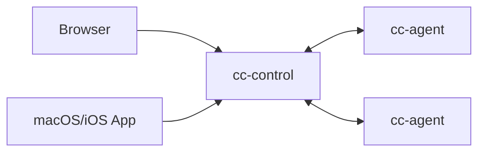

# Agent Control (AI Agent Control Plane MVP)

Minimal multi-server controller for launching and managing AI coding tool sessions (for example: Claude Code, Codex, Gemini CLI, OpenCode).

## Layout



- `cc-control/`: control plane (REST + WS + audit + prompt detection)
- `cc-agent/`: per-server agent (WS outbound, PTY spawn/stream/input)
- `ui/`: static browser UI (`xterm.js`)
- `app/AgentControlMac/`: macOS/iOS native client

架构详图与部署拓扑见 **`docs/architecture.md`**（Mermaid）。

## Quick Start

Only for test, for depolyment see `docs/deploy-public-server.md`.

1. Start control plane:

```bash
cd cc-control
go run ./cmd/cc-control \
  -addr :18080 \
  -ui-dir ../ui \
  -agent-token agent-dev-token \
  -ui-token admin-dev-token
```

2. Start one agent on a server:

```bash
cd cc-agent
go run ./cmd/cc-agent \
  -control-url ws://127.0.0.1:18080/ws/agent \
  -agent-token agent-dev-token \
  -server-id srv-local \
  -allow-root /path/to/repo \
  -claude-path /path/to/ai-cli
```

Example executable paths (use your own environment values):

```bash
# OpenCode
-claude-path /path/to/opencode

# Codex
-claude-path /path/to/codex

# Gemini CLI
-claude-path /path/to/gemini
```

3. Open browser:

`http://127.0.0.1:18080`

Use UI token: `admin-dev-token`.

## What Works

- Server register + heartbeat online/offline
- Create session on selected server
- PTY stream to xterm.js and input roundtrip
- Resize + stop session (TERM then KILL)
- Prompt detection (`approve/reject`, `(y/n)`, etc.) with global pending queue
- Approve/Reject actions mapped to `y\n` / `n\n`
- JSONL audit log (`cc-control/audit.jsonl`)

## Security Baseline (MVP)

- Agent-side cwd whitelist (`-allow-root`)
- Runtime executable configurable via `-claude-path` (supports different AI CLIs)
- Env allowlist/prefix on agent (`-env-allow-keys`, `-env-allow-prefix`)
- Separate agent/UI bearer tokens
- Basic per-token rate limiting on control plane

## Docs

- **架构（Mermaid）**: `docs/architecture.md`
- API reference (REST + WS): `docs/api.md`
- Public deployment guide: `docs/deploy-public-server.md`

