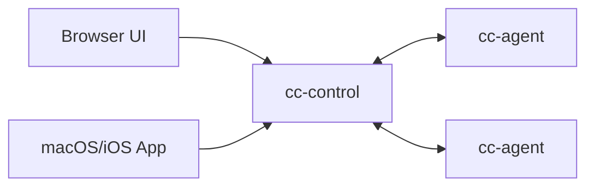

# Agent Control (AI Agent Control Plane MVP)

Multi-server control plane for AI coding runtimes (Claude Code, Codex, Gemini CLI, OpenCode).

## Layout



- `cc-control/`: control plane (`REST + WS + audit + token management + optional prompt detection`)
- `cc-agent/`: per-server agent (`WS outbound + PTY spawn/stream/input`)
- `ui/`: static browser UI (`xterm.js`)
- `app/AgentControlMac/`: native macOS/iOS client

## Quick Start (Current Version)

For production deployment (including TLS), use `docs/deploy-public-server.md`.

1. Start `cc-control` with an admin token.

```bash
cd cc-control
go run ./cmd/cc-control \
  -addr :18080 \
  -ui-dir ../ui \
  -admin-token admin-dev-token \
  -audit-path ./audit.jsonl \
  -offline-after-sec 30
```

2. Create UI/Agent tokens via Admin API.

```bash
# Create UI token (owner role). Save both token and tenant_id from response.
curl -X POST http://127.0.0.1:18080/admin/tokens \
  -H "Authorization: Bearer admin-dev-token" \
  -H "Content-Type: application/json" \
  -d '{"type":"ui","role":"owner"}'

# Create Agent token for the same tenant_id.
curl -X POST http://127.0.0.1:18080/admin/tokens \
  -H "Authorization: Bearer admin-dev-token" \
  -H "Content-Type: application/json" \
  -d '{"type":"agent","tenant_id":"<tenant_id>"}'
```

3. Start one `cc-agent`.

```bash
cd cc-agent
go run ./cmd/cc-agent \
  -control-url ws://127.0.0.1:18080/ws/agent \
  -agent-token <agent-token> \
  -server-id srv-local \
  -allow-root /path/to/repo \
  -claude-path /path/to/ai-cli
```

Example executable values for `-claude-path`:

```bash
/path/to/opencode
/path/to/codex
/path/to/gemini
```

4. Open browser UI:

`http://127.0.0.1:18080`

Login with the UI token returned by `/admin/tokens`.

## Token Model (Latest)

- Recommended: use `-admin-token` + `POST /admin/tokens` for multi-tenant tokens.
- UI token roles: `viewer` / `operator` / `owner`.
- Legacy compatibility: `-ui-token` and `-agent-token` are still accepted and seeded into a default tenant.
- Admin-generated tokens are in-memory; restart clears them unless you reseed at startup.

## Deployment Modes

- Direct HTTP (`ws://`): fast testing in trusted networks.
- Nginx + TLS (Let's Encrypt): recommended for production with domain.
- Nginx + self-signed TLS (`wss://<ip>`): no domain but encrypted transport.

Full guide: `docs/deploy-public-server.md`

## Upgrade Note (Breaking Allowed)

- If you migrate from legacy `-ui-token/-agent-token` to admin-token mode, switch `cc-control` to `-admin-token` first.
- Then issue fresh UI/Agent tokens via `POST /admin/tokens` and restart agents with the new agent token.
- During cutover, `servers` may appear empty until agents reconnect with new token.
- For self-signed TLS, agent must add `-tls-skip-verify`.

## Current Capabilities

- Server register + heartbeat online/offline
- Session create/attach/resize/stop/delete
- PTY streaming to UI/App and input roundtrip
- Optional prompt detection (`-enable-prompt-detection`, default off)
- Approve/Reject action routing (`y/n`, Enter/Esc patterns)
- JSONL audit log (`cc-control/audit.jsonl`)
- Token issue/list/revoke admin API with tenant isolation

## Security Baseline (MVP)

- Agent-side cwd whitelist (`-allow-root`)
- Runtime executable path control (`-claude-path`)
- Env allowlist/prefix (`-env-allow-keys`, `-env-allow-prefix`)
- Token-based tenant isolation with role checks
- Basic per-token rate limiting in control plane

## Docs

- Architecture: `docs/architecture.md`
- API reference: `docs/api.md`
- Public deployment guide: `docs/deploy-public-server.md`
