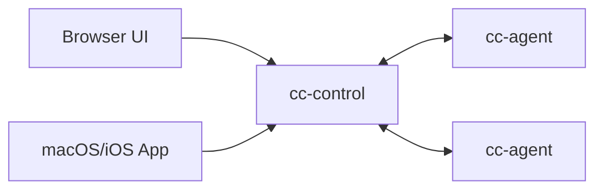

# Agent Control (AI Agent Control Plane MVP)

Multi-server control plane for AI coding runtimes (Claude Code, Codex, Gemini CLI, OpenCode).

## Layout



- `cc-control/`: control plane (`REST + WS + audit + token management + optional prompt detection`)
- `cc-agent/`: per-server agent (`WS outbound + PTY spawn/stream/input`)
- `ui/`: static browser UI (`xterm.js`)
- `app/AgentControlMac/`: native macOS/iOS client

## Quick Start

For production deployment (including TLS), use `docs/deploy-public-server.md`.

1. Start `cc-control` with an admin token.

```bash
cd cc-control
go run ./cmd/cc-control \
  -addr :18080 \
  -ui-dir ../ui \
  -admin-token admin-dev-token \
  -ui-token "" \
  -agent-token "" \
  -audit-path ./audit.jsonl \
  -offline-after-sec 30
```

2. Create token via web

Open `http://127.0.0.1:18080`, then use the left sidebar `Admin` tab.

2.1 Create Tenant UI token

- Fill `admin token` (for example `admin-dev-token`).
- Set `token type = ui`.
- Set `ui role = owner` (or `viewer/operator` as needed).
- Leave `tenant id` empty to auto-create a new tenant.
- Click `Generate Token`.
- Save the generated `token` (UI login token) and `tenant` (tenant id).
- Optional: click `Use As UI Token` to switch current UI login directly.

2.2 Create Tenant Agent token

- Keep the same `tenant id` from 2.1.
- Set `token type = agent`.
- Click `Generate Token`.
- Save the generated `token` as `-agent-token` for `cc-agent`.

2.3 Optional management

- Click `List Tokens` to view issued tokens (supports tenant filter).
- Click `Revoke` to revoke a token by `token_id`.


3. Create token via CLI.

3.1 UI token

```bash
# Tenant: create UI token (owner role), response includes tenant_id
curl -X POST http://127.0.0.1:18080/admin/tokens \
  -H "Authorization: Bearer admin-dev-token" \
  -H "Content-Type: application/json" \
  -d '{"type":"ui","role":"owner"}'
```

Example Tenant UI token response:

```json
{
  "created_at_ms": 1770964695390,
  "role": "owner",
  "tenant_id": "<tenant-a-id>",
  "token": "<tenant-a-ui-token>",
  "token_id": "<tenant-a-ui-token-id>",
  "type": "ui"
}
```

- `token`: use this as the UI login token for Tenant.
- `tenant_id`: must be reused when creating Tenant agent tokens.

3.2 Agent Token

```bash
# Tenant: create Agent token with the same tenant_id
curl -X POST http://127.0.0.1:18080/admin/tokens \
  -H "Authorization: Bearer admin-dev-token" \
  -H "Content-Type: application/json" \
  -d '{"type":"agent","tenant_id":"<tenant-a-id>"}'
```

Example Tenant A Agent token response:

```json
{
  "created_at_ms": 1770964737109,
  "role": "",
  "tenant_id": "<tenant-a-id>",
  "token": "<tenant-a-agent-token>",
  "token_id": "<tenant-a-agent-token-id>",
  "type": "agent"
}
```

- `token`: use this as `-agent-token` when starting Tenant A `cc-agent`.
- `token` is returned in plaintext only once; if leaked, revoke and re-issue immediately.

4. Start one `cc-agent` for Tenant A.

```bash
cd cc-agent
go run ./cmd/cc-agent \
  -control-url ws://127.0.0.1:18080/ws/agent \
  -agent-token <tenant-a-agent-token> \
  -server-id srv-local \
  -allow-root /path/to/repo \
  -claude-path /path/to/ai-cli
```

Example executable values for `-claude-path`:

```bash
/path/to/opencode
/path/to/codex
/path/to/gemini
```

5. Open browser UI:

`http://127.0.0.1:18080`

Use the sidebar `Admin` panel (optional) to create tokens from UI:

- Fill `admin token`.
- Choose `token type` (`ui` or `agent`), plus `ui role` when type is `ui`.
- (Optional) keep/reuse `tenant id` to issue matching UI + Agent tokens for one tenant.
- Click `Generate Token`.
- Click `List Tokens` to query existing tokens (supports optional tenant filter).
- Click `Revoke` in the token list to revoke a token by `token_id`.
- For a generated UI token, click `Use As UI Token` to switch current UI login quickly.

Or login with the Tenant A UI token returned by `/admin/tokens` (curl flow above).

## Token Model (Latest)

- Recommended: use `-admin-token` + `POST /admin/tokens` for multi-tenant tokens.
- UI token roles: `viewer` / `operator` / `owner`.
- Legacy compatibility: `-ui-token` and `-agent-token` are still accepted and seeded into a default tenant.
- Admin-generated tokens are in-memory; restart clears them unless you reseed at startup.

## Deployment Modes

- Direct HTTP (`ws://`): fast testing in trusted networks.
- Nginx + TLS (Let's Encrypt): recommended for production with domain.
- Nginx + self-signed TLS (`wss://<ip>`): no domain but encrypted transport.

Full guide: `docs/deploy-public-server.md`

## Upgrade Note (Breaking Allowed)

- If you migrate from legacy `-ui-token/-agent-token` to admin-token mode, switch `cc-control` to `-admin-token` first.
- Then issue fresh UI/Agent tokens via `POST /admin/tokens` and restart agents with the new agent token.
- During cutover, `servers` may appear empty until agents reconnect with new token.
- For self-signed TLS, agent must add `-tls-skip-verify`.

## Current Capabilities

- Server register + heartbeat online/offline
- Session create/attach/resize/stop/delete
- PTY streaming to UI/App and input roundtrip
- Optional prompt detection (`-enable-prompt-detection`, default off)
- Approve/Reject action routing (`y/n`, Enter/Esc patterns)
- JSONL audit log (`cc-control/audit.jsonl`)
- Token issue/list/revoke admin API with tenant isolation

## Security Baseline (MVP)

- Agent-side cwd whitelist (`-allow-root`)
- Runtime executable path control (`-claude-path`)
- Env allowlist/prefix (`-env-allow-keys`, `-env-allow-prefix`)
- Token-based tenant isolation with role checks
- Basic per-token rate limiting in control plane

## Docs

- Architecture: `docs/architecture.md`
- API reference: `docs/api.md`
- Public deployment guide: `docs/deploy-public-server.md`
