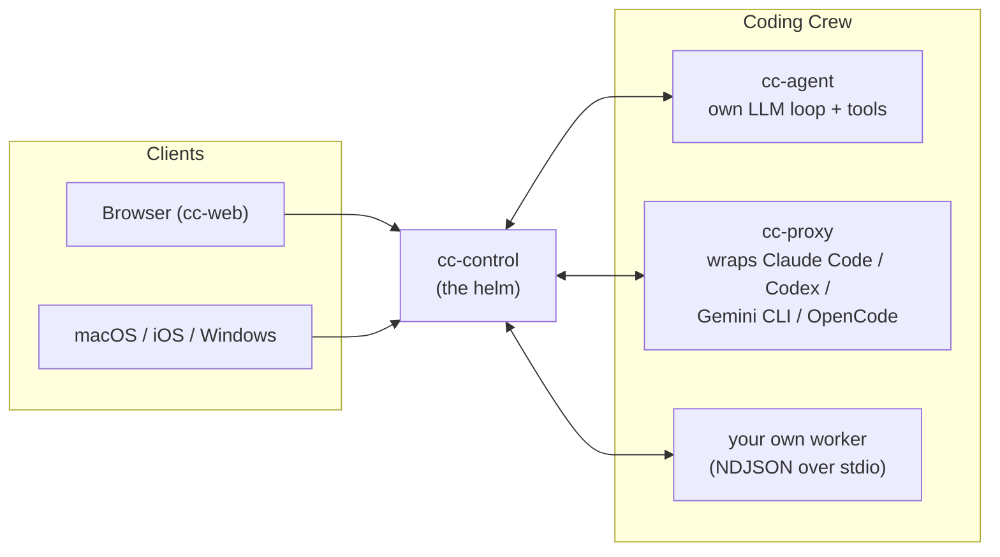

# Agent Control (AI Agent Control Plane MVP)

A control plane for your **Coding Crew** — orchestrate Claude Code, Codex, Gemini CLI, OpenCode, and the agents you build yourself, all under one helm.

> **CC** = **Coding Crew.** The `cc-` prefix throughout this repo (`cc-control`, `cc-agent`, `cc-web`, `cc-proxy`, `cc-console`) reflects this: a fleet of coding agents you command, rather than any single vendor's CLI. See [`docs/coding-crew.md`](docs/coding-crew.md) for the naming rationale and shared vocabulary.

## Highlights

- **Single binary, REPL-first** — start `cc-agent` standalone with one LLM key. No control plane, no UI required.
- **Bring any coding CLI** — `cc-proxy` wraps Claude Code, Codex, Gemini CLI, or OpenCode and surfaces it as a regular session.
- **Web / iOS / macOS / Windows clients** — all share one WebSocket protocol against `cc-control`.
- **Skill marketplace (v0.8.0)** — `:reflect` a skill on one host, `:publish` to `cc-control`, `:install` on the rest of the fleet.
- **Approval gate for destructive commands** — `rm -rf`, `mkfs`, `shutdown`, etc. wait for an Approve in the UI; auto-deny after timeout.
- **Multi-tenant by design** — token-scoped isolation, JSONL audit log, per-token rate limiting.

## Architecture


```mermaid
flowchart LR
    subgraph Clients["Clients"]
        Web["Browser (cc-web)"]
        Native["macOS / iOS / Windows"]
    end
    Helm["cc-control<br/>(the helm)"]
    subgraph Crew["Coding Crew"]
        Agent["cc-agent<br/>own LLM loop + tools"]
        Proxy["cc-proxy<br/>wraps Claude Code / Codex /<br/>Gemini CLI / OpenCode"]
        Custom["your own worker<br/>(NDJSON over stdio)"]
    end
    Web --> Helm
    Native --> Helm
    Helm <--> Agent
    Helm <--> Proxy
    Helm <--> Custom
```

| Module | Role |
|---|---|
| [`cc-control/`](cc-control/) | Control plane (helm): REST + WS + token / session / audit / skill registry |
| [`cc-agent/`](cc-agent/) | Self-driving agent: own LLM loop + 8 built-in tools (`bash`, `read`, `write`, `grep`, `glob`, `sysinfo`, `proclist`, `logtail`) with destructive-command approval |
| [`cc-proxy/`](cc-proxy/) | PTY proxy that wraps Claude Code, Codex, Gemini CLI, or OpenCode as a session |
| [`cc-web/`](cc-web/) | Static browser UI (xterm.js terminal + chat bubble UI), served by `cc-control` |
| [`cc-console/`](cc-console/) | Self-service signup site for the hosted offering at `console.cc-remote.app` |
| [`app/AgentControlMac/`](app/AgentControlMac/) | Native macOS / iOS client (same WS protocol as `cc-web`) |

## Quick Start

The fastest way to see Agent Control work is to run **`cc-agent` standalone** — one binary, one LLM key, REPL prompt. No control plane, no UI, no remote.

```bash
mkdir -p ~/cc-agent && cd ~/cc-agent
curl -LO https://github.com/xuzhougeng/agent-control/releases/download/v0.8.0/cc-agent-linux-amd64
chmod +x cc-agent-linux-amd64 && mv cc-agent-linux-amd64 cc-agent

# DeepSeek key — cheapest to start; swap providers later
echo 'sk-xxxxxxxxxxxx' > ~/.cc-agent-key && chmod 600 ~/.cc-agent-key
mkdir -p ~/cc-agent/yard

CC_AGENT_API_KEY="$(cat ~/.cc-agent-key)" \
CC_AGENT_BASE_URL="https://api.deepseek.com" \
./cc-agent -provider deepseek -model deepseek-chat \
           -cwd ~/cc-agent/yard \
           -memory ~/cc-agent/sessions.db
```

You get a REPL prompt — ask it to do something:

```
you> what's the kernel version on this box?
▶ bash {command=uname -r}
✓ exit_code=0  6.6.87.2-microsoft-standard-WSL2
Kernel version: 6.6.87.2-microsoft-standard-WSL2
```

That's the whole standalone story. Linux / macOS / Windows × amd64 / arm64 binaries are on the [Releases page](https://github.com/xuzhougeng/agent-control/releases).

中文 5 分钟教程：[`docs/tutorial/01-quickstart.md`](docs/tutorial/01-quickstart.md).

## Going Further

| You want… | Read |
|---|---|
| Web / mobile UI driving `cc-agent` from a remote server | [Getting Started · step 2](docs/getting-started.md#2--connect-cc-agent-to-cc-control-web--mobile-ui) |
| Wrap **Claude Code / Codex / Gemini CLI / OpenCode** through the same UI | [Getting Started · step 3 (cc-proxy)](docs/getting-started.md#3--cc-proxy--wrap-an-external-cli-agent) |
| Hosted `cc-control` (no setup) | <https://console.cc-remote.app> · [iOS / macOS app](https://apps.apple.com/us/app/cc-remote/id6759078097) |
| Self-host `cc-control` (TLS / Cloudflare Tunnel / systemd) | [Public-server deployment](docs/deploy-public-server.md) |
| Token model, tenants, admin / UI / agent token issuance | [Tutorial · 02-deploy](docs/tutorial/02-deploy.md) · [API reference](docs/api.md) |
| Skill marketplace (`:publish` / `:install` / Skills tab) | [v0.8.0 release notes](docs/v0.8.0-release-notes.md) |
| Chat mode + custom worker (NDJSON protocol) | [Chat mode & permissions](docs/chat-mode-permissions.md) |

## Documentation

- [Docs index 文档索引](docs/README.md) — the entry point for everything below
- [Architecture](docs/architecture.md) · [API reference](docs/api.md) · [Use cases](docs/use-cases.md)
- [Tutorial 教程](docs/tutorial/) — Chinese, step-by-step from local to production
- [Coding Crew naming](docs/coding-crew.md) — what `cc-*` stands for, shared vocabulary
- Release notes: [v0.8.0](docs/v0.8.0-release-notes.md) · [v0.7.3](docs/v0.7.3-release-notes.md) · [v0.7.2](docs/v0.7.2-release-notes.md) · [v0.7.1](docs/v0.7.1-release-notes.md) · [v0.7.0](docs/v0.7.0-release-notes.md)
