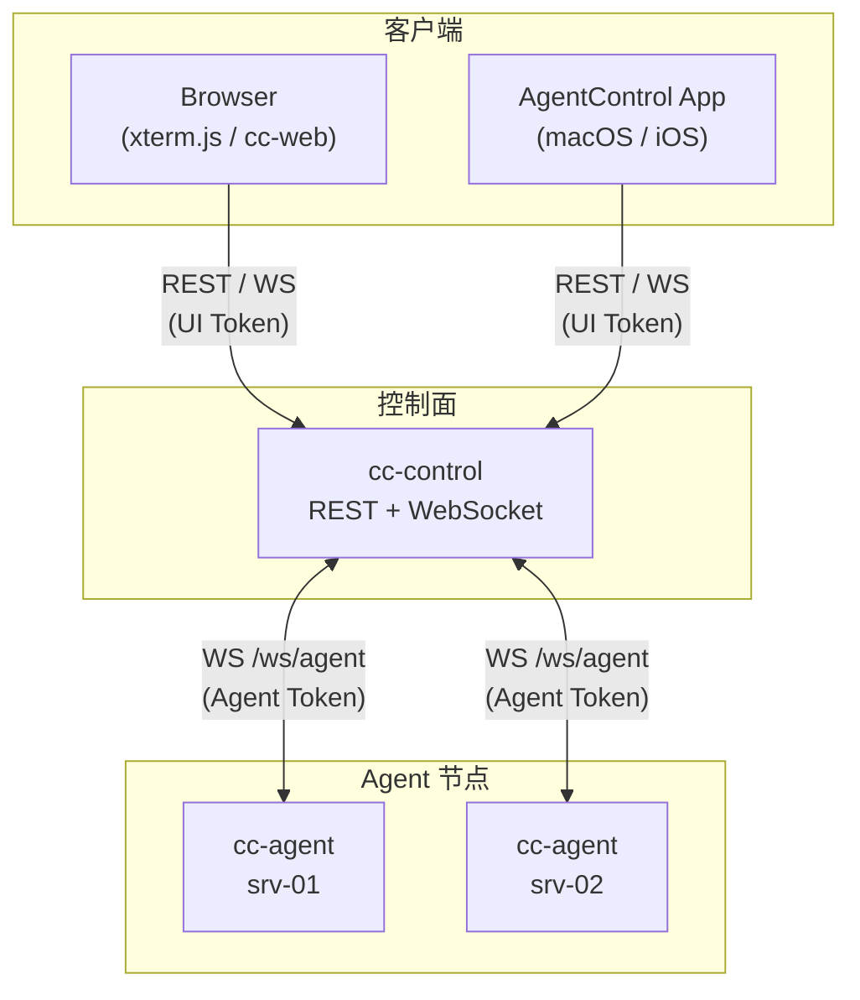
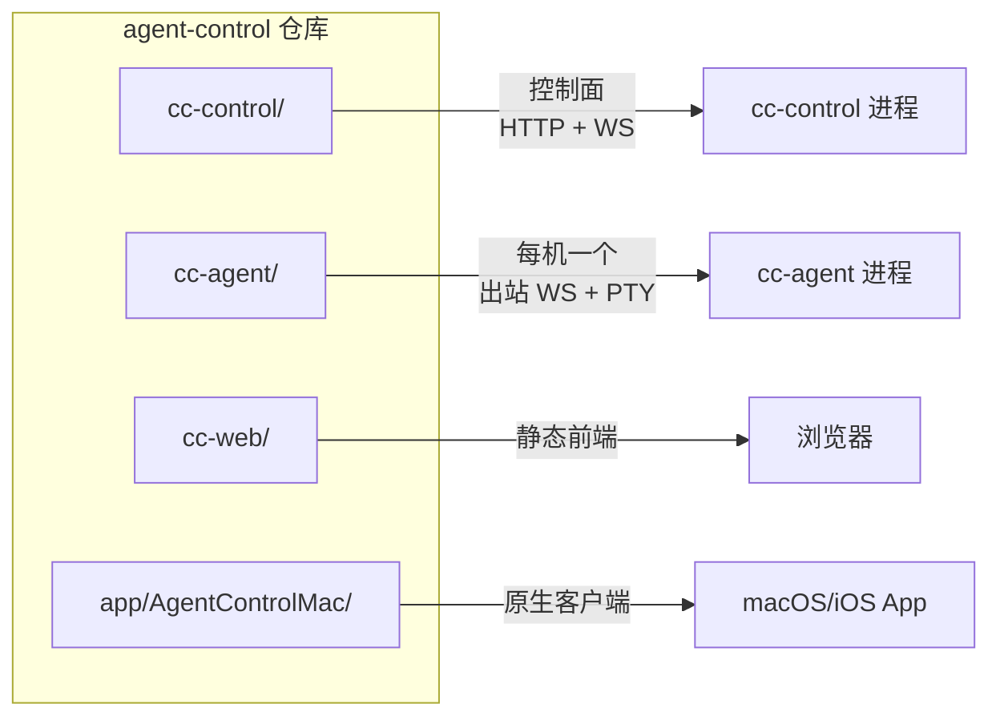
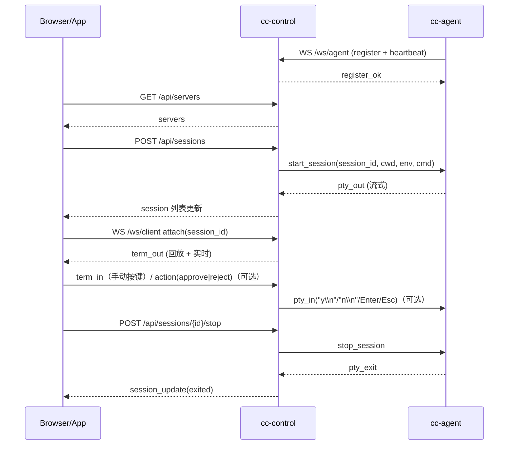
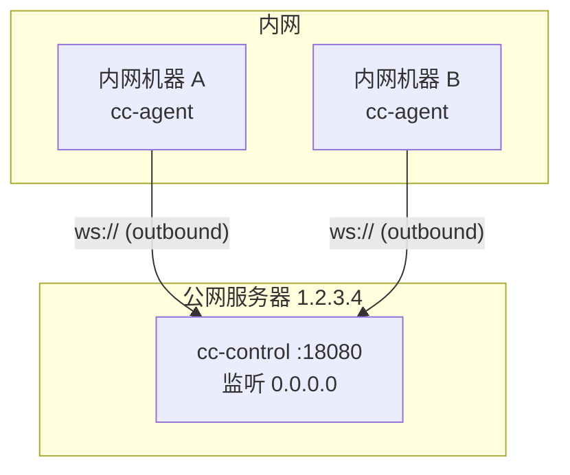
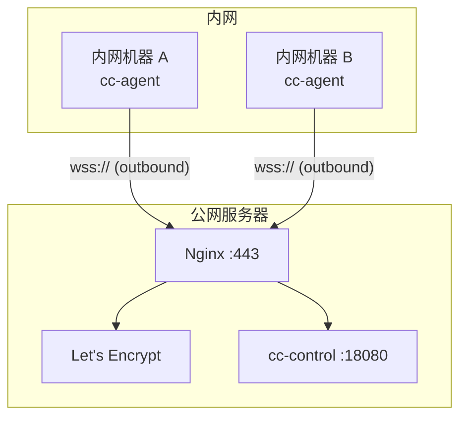

# Agent Control 架构

## 系统总览

## 多用户隔离（匿名租户）

- `agent_token` 与 `ui_token` 均绑定 `tenant_id`，中心服务器只按 tenant 维度隔离，不关心真实身份。
- UI 角色：`viewer` / `operator` / `owner`。
- `admin_token` 用于生成/撤销 tenant token。
- `tenant_token` 用于该租户自助签发 UI/Agent token（每次生成会刷新旧 token）。
- token 默认内存态；可通过 `-token-db` / `TOKEN_DB` 持久化到 SQLite 以跨重启保留。

## 组件与目录

## 核心数据流（创建会话与终端）

> 说明：`approval_needed`/Pending Approvals 属于 **启发式 prompt detection**（`cc-control -enable-prompt-detection`），默认关闭；关闭时不会自动产生 Pending Approvals，但终端交互（`term_in`）仍可正常使用。

## 部署拓扑：直连（方案 A）

## 部署拓扑：Nginx + TLS（方案 B）

## 依赖与技术栈

各子项目使用的依赖库如下，便于后续开发与升级。

### 前端（cc-web/）

- **技术**：原生 HTML/CSS/JavaScript，无构建工具，无 `package.json`。
- **运行时依赖**（通过 CDN 引入，见 `cc-web/index.html`）：
  - **xterm.js** — 终端模拟（`xterm/lib/xterm.js`、`xterm/css/xterm.css`）
  - **xterm-addon-fit** — 终端自适应窗口大小（`xterm-addon-fit/lib/xterm-addon-fit.js`）

### 控制面（cc-control/）

- **语言**：Go 1.25
- **依赖**（`cc-control/go.mod`）：

| 依赖 | 用途 |
|------|------|
| `github.com/google/uuid` | 生成 session_id 等唯一标识 |
| `github.com/gorilla/websocket` | WebSocket 服务端（/ws/agent、/ws/client） |
| `modernc.org/sqlite` | SQLite 驱动（`-token-db` 持久化 token） |

### Agent 节点（cc-agent/）

- **语言**：Go 1.25
- **依赖**（`cc-agent/go.mod`）：

| 依赖 | 用途 |
|------|------|
| `github.com/creack/pty` | 创建 PTY，与 shell/子进程交互 |
| `github.com/gorilla/websocket` | 出站 WebSocket 连接控制面 |

### macOS / iOS 客户端（app/AgentControlMac/）

- **语言**：Swift，Xcode 项目 + Swift Package Manager
- **直接依赖**（SPM）：
  - **SwiftTerm**（`migueldeicaza/SwiftTerm`）— 终端渲染与输入，macOS 用 `NSViewRepresentable`，iOS 用 `UIViewRepresentable`
- **传递依赖**（`Package.resolved` 中）：
  - **swift-argument-parser** — 由 SwiftTerm 引入
