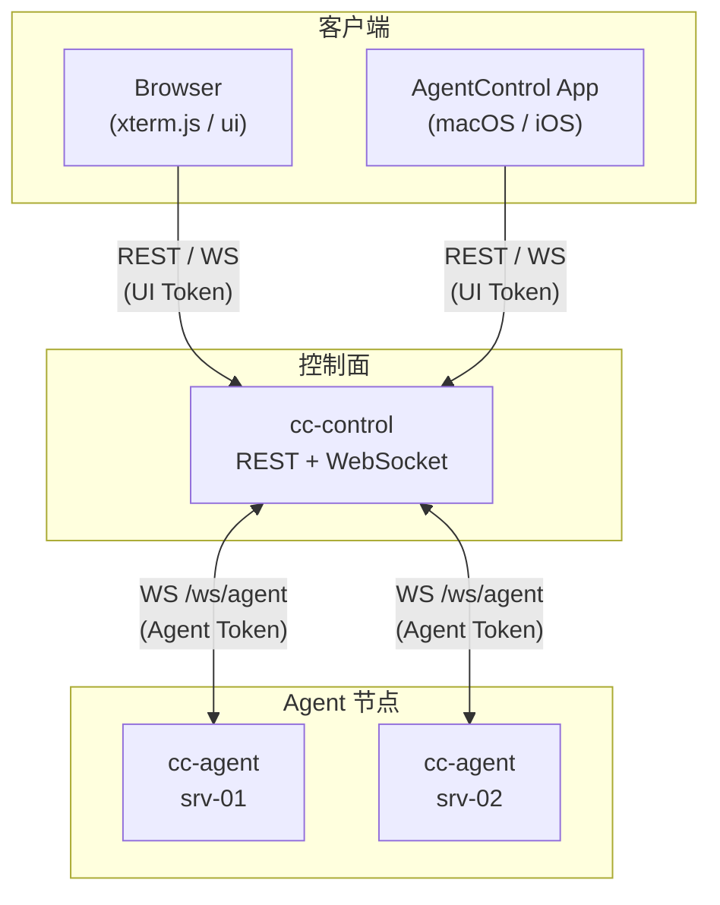
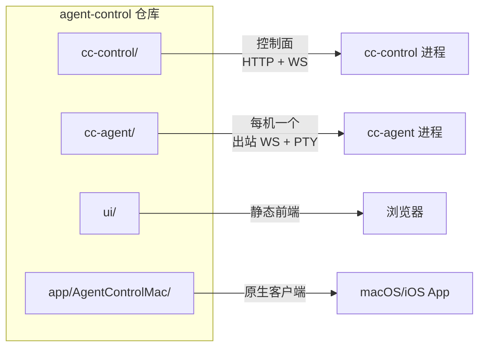
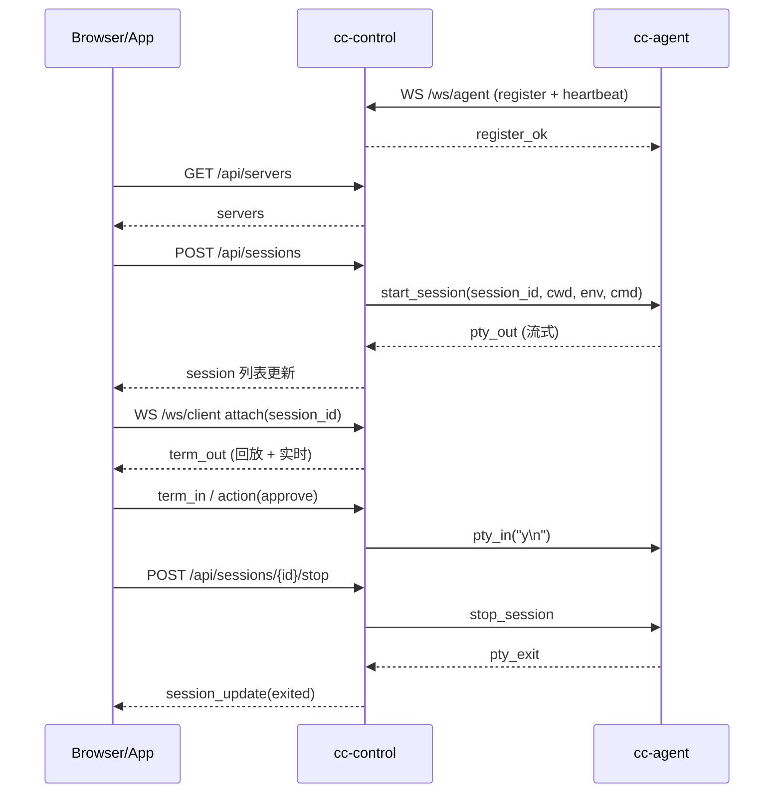
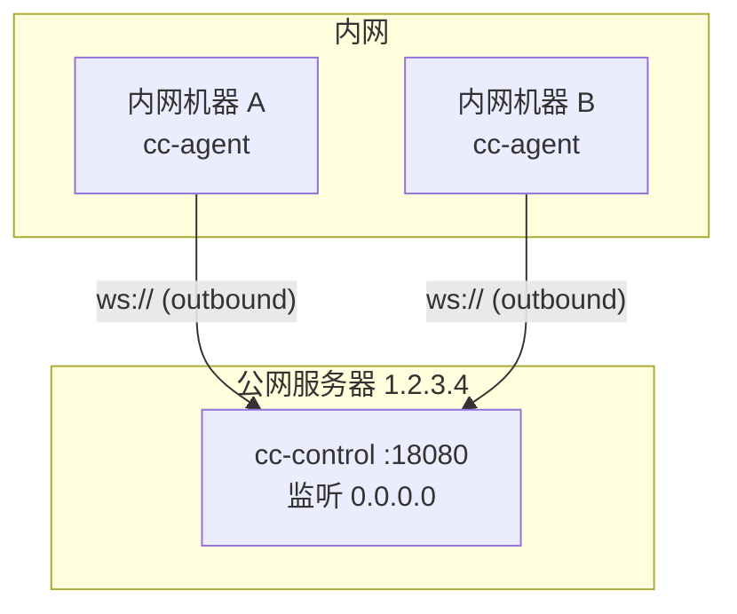
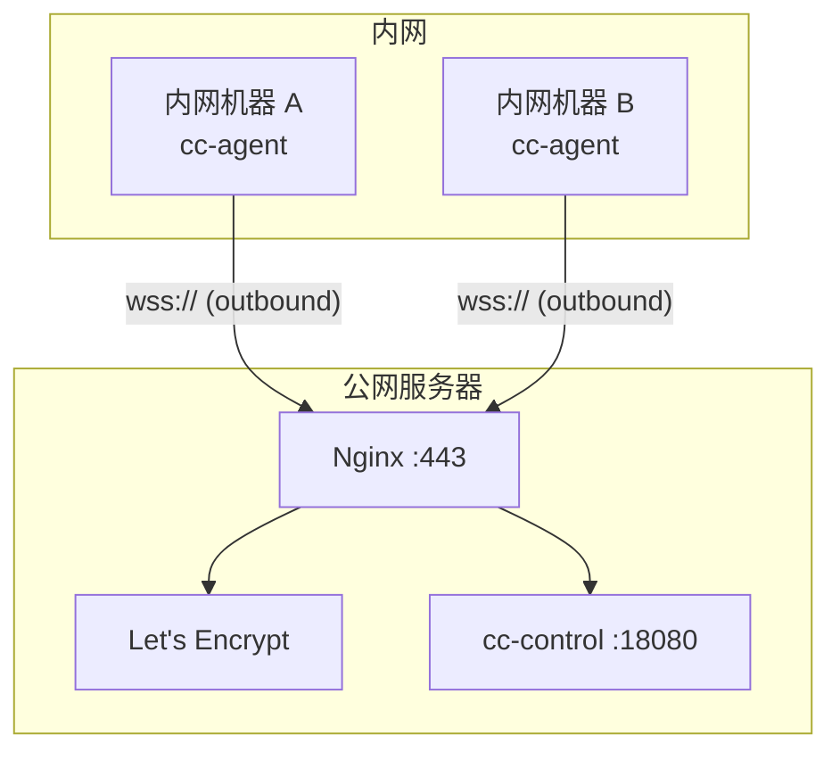

# Agent Control 架构

## 系统总览

```mermaid
flowchart TB
    subgraph Clients["客户端"]
        Browser["Browser\n(xterm.js / ui)"]
        App["AgentControl App\n(macOS / iOS)"]
    end

    subgraph Control["控制面"]
        CC["cc-control\nREST + WebSocket"]
    end

    subgraph Agents["Agent 节点"]
        A1["cc-agent\nsrv-01"]
        A2["cc-agent\nsrv-02"]
    end

    Browser -->|"REST / WS\n(UI Token)"| CC
    App -->|"REST / WS\n(UI Token)"| CC
    CC <-->|"WS /ws/agent\n(Agent Token)"| A1
    CC <-->|"WS /ws/agent\n(Agent Token)"| A2
```

## 组件与目录

```mermaid
flowchart LR
    subgraph Repo["agent-control 仓库"]
        CC_DIR["cc-control/"]
        AGENT_DIR["cc-agent/"]
        UI_DIR["ui/"]
        APP_DIR["app/AgentControlMac/"]
    end

    CC_DIR -->|"控制面\nHTTP + WS"| CC_SVC["cc-control 进程"]
    AGENT_DIR -->|"每机一个\n出站 WS + PTY"| AGENT_SVC["cc-agent 进程"]
    UI_DIR -->|"静态前端"| BROWSER["浏览器"]
    APP_DIR -->|"原生客户端"| NATIVE["macOS/iOS App"]
```

## 核心数据流（创建会话与终端）

```mermaid
sequenceDiagram
    participant UI as Browser/App
    participant CP as cc-control
    participant Agent as cc-agent

    Agent->>CP: WS /ws/agent (register + heartbeat)
    CP-->>Agent: register_ok
    UI->>CP: GET /api/servers
    CP-->>UI: servers
    UI->>CP: POST /api/sessions
    CP->>Agent: start_session(session_id, cwd, env, cmd)
    Agent-->>CP: pty_out (流式)
    CP-->>UI: session 列表更新
    UI->>CP: WS /ws/client attach(session_id)
    CP-->>UI: term_out (回放 + 实时)
    UI->>CP: term_in / action(approve)
    CP->>Agent: pty_in("y\n")
    UI->>CP: POST /api/sessions/{id}/stop
    CP->>Agent: stop_session
    Agent-->>CP: pty_exit
    CP-->>UI: session_update(exited)
```

## 部署拓扑：直连（方案 A）

```mermaid
flowchart TB
    subgraph Public["公网服务器 1.2.3.4"]
        CC["cc-control :18080\n监听 0.0.0.0"]
    end

    subgraph Intranet["内网"]
        A1["内网机器 A\ncc-agent"]
        A2["内网机器 B\ncc-agent"]
    end

    A1 -->|"ws:// (outbound)"| CC
    A2 -->|"ws:// (outbound)"| CC
```

## 部署拓扑：Nginx + TLS（方案 B）

```mermaid
flowchart TB
    subgraph Public["公网服务器"]
        LE["Let's Encrypt"]
        Nginx["Nginx :443"]
        CC["cc-control :18080"]
        Nginx --> LE
        Nginx --> CC
    end

    subgraph Intranet["内网"]
        A1["内网机器 A\ncc-agent"]
        A2["内网机器 B\ncc-agent"]
    end

    A1 -->|"wss:// (outbound)"| Nginx
    A2 -->|"wss:// (outbound)"| Nginx
```
