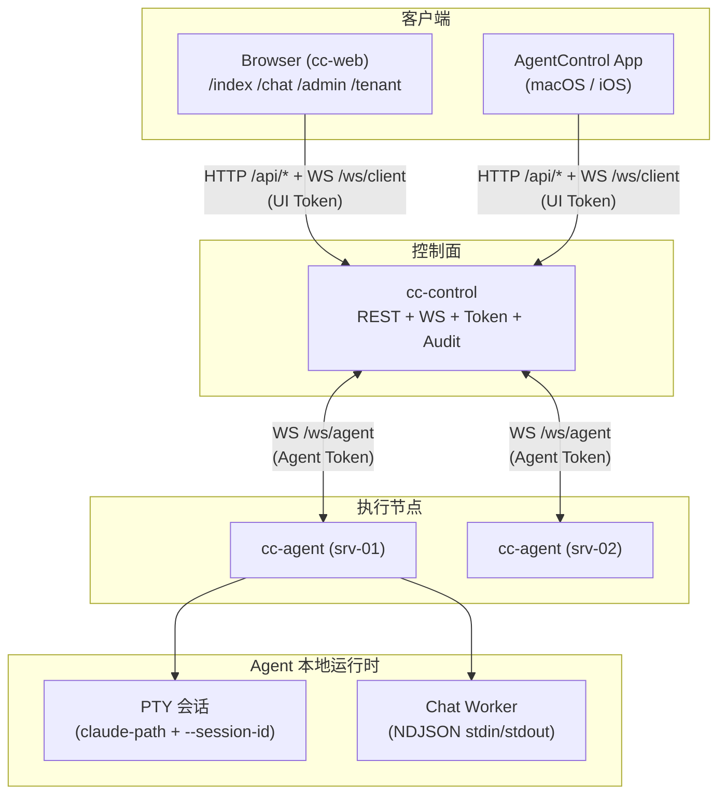
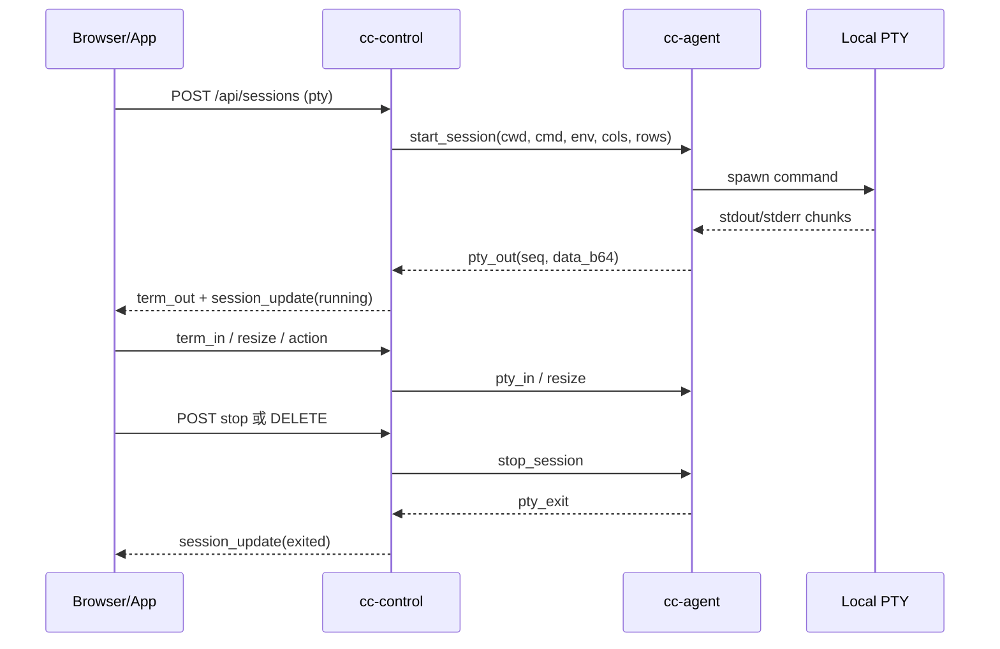
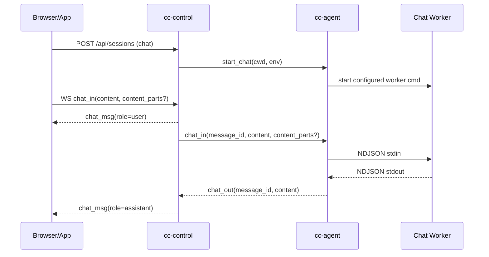
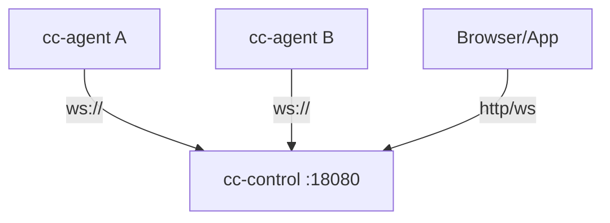
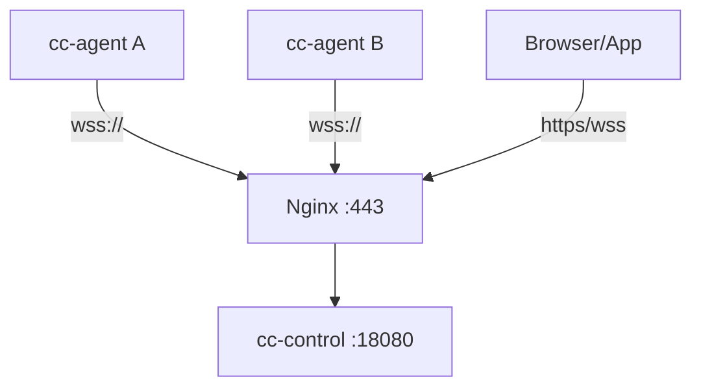

# Agent Control 架构

本文档基于当前代码实现（`cc-control/` + `cc-agent/` + `cc-web/`）描述系统结构与关键数据流。

## 1. 系统总览


```mermaid
flowchart TB
    subgraph Clients["客户端"]
        Browser["Browser (cc-web)\n/index /chat /admin /tenant"]
        App["AgentControl App\n(macOS / iOS)"]
    end

    subgraph Control["控制面"]
        CC["cc-control\nREST + WS + Token + Audit"]
    end

    subgraph Nodes["执行节点"]
        A1["cc-agent (srv-01)"]
        A2["cc-agent (srv-02)"]
    end

    subgraph Runtime["Agent 本地运行时"]
        PTY["PTY 会话\n(claude-path + --session-id)"]
        CHAT["Chat Worker\n(NDJSON stdin/stdout)"]
    end

    Browser -->|"HTTP /api/* + WS /ws/client\n(UI Token)"| CC
    App -->|"HTTP /api/* + WS /ws/client\n(UI Token)"| CC
    CC <-->|"WS /ws/agent\n(Agent Token)"| A1
    CC <-->|"WS /ws/agent\n(Agent Token)"| A2
    A1 --> PTY
    A1 --> CHAT
```

## 2. 组件职责

| 组件 | 主要职责 |
|---|---|
| `cc-control` | 统一入口；维护 server/session 状态；REST 管理接口；WS 转发；审批事件；审计日志 |
| `cc-agent` | 与控制面建立出站 WS；处理 `start_session/start_chat/pty_in/resize/stop_session/chat_in` |
| `cc-web` | 静态前端；终端页（PTY）与聊天页（Chat）；Admin/Tenant token 管理页 |
| `app/AgentControlMac` | 原生 macOS/iOS 客户端，通过同一 REST/WS 协议接入 |

## 3. 认证与租户隔离

系统按 `tenant_id` 做强隔离，服务端不依赖真实用户身份。

- Token 类型：`ui` / `agent` / `tenant` / `admin`
- UI 角色：`viewer` / `operator` / `owner`
- `admin_token`：管理租户与 token（`/admin/*`）
- `tenant_token`：自助签发当前租户 UI/Agent token（`/tenant/tokens`）
- `ui_token`：访问 `/api/*` 与 `/ws/client`
- `agent_token`：连接 `/ws/agent`

Token 默认在内存中；配置 `-token-db`（或 `TOKEN_DB`）后会持久化到 SQLite。

## 4. 控制面内部模型

`ControlPlane` 内部维护以下核心状态（内存态）：

- `servers`: `server_id -> Server`
- `sessions`: `session_id -> Session`
- `sessionEvents`: `session_id -> []SessionEvent`
- `sessionHubs`: `session_id -> {ring buffer + subscribers}`
- `agentConns`: `server_id -> WS sender`
- `chatHistory`: `session_id -> []ChatMessage`（最多 200 条）

关键机制：

- Ring buffer：为 PTY 会话缓存最近输出，`attach` 时支持快照回放。
- 心跳与离线判定：agent 5s 心跳，超时按 `-offline-after-sec` 标离线。
- 速率限制：按 token 维度限速（UI/Agent/Tenant）。
- 审计：关键动作写入 `audit.jsonl`。

## 5. 通信面与协议

统一 WS 封包：

```json
{
  "type": "xxx",
  "server_id": "optional",
  "session_id": "optional",
  "seq": 123,
  "ts_ms": 1730000000000,
  "data": {},
  "data_b64": "optional"
}
```

| 通道 | 方向 | 关键消息 |
|---|---|---|
| REST `/api/*` | UI/App -> Control | `GET /api/servers`、`POST /api/sessions`、`POST /api/sessions/{id}/stop`、`DELETE /api/sessions/{id}` |
| WS `/ws/client` | UI/App <-> Control | `attach`、`term_in`、`resize`、`action`、`chat_in`；下行 `term_out`、`chat_msg`、`event`、`session_update` |
| WS `/ws/agent` | Agent <-> Control | 上行 `register/heartbeat/pty_out/pty_exit/chat_out/chat_exit/error`；下行 `start_session/start_chat/pty_in/resize/stop_session` |

## 6. 会话生命周期

### 6.1 PTY 模式（`session_type=pty`）


```mermaid
sequenceDiagram
    participant UI as Browser/App
    participant CP as cc-control
    participant Agent as cc-agent
    participant PTY as Local PTY

    UI->>CP: POST /api/sessions (pty)
    CP->>Agent: start_session(cwd, cmd, env, cols, rows)
    Agent->>PTY: spawn command
    PTY-->>Agent: stdout/stderr chunks
    Agent-->>CP: pty_out(seq, data_b64)
    CP-->>UI: term_out + session_update(running)
    UI->>CP: term_in / resize / action
    CP->>Agent: pty_in / resize
    UI->>CP: POST stop 或 DELETE
    CP->>Agent: stop_session
    Agent-->>CP: pty_exit
    CP-->>UI: session_update(exited)
```

补充：

- `session_id` 是会话唯一标识，可由客户端传入（UUID）或由服务端生成。
- 同一个 `session_id` 可与同一 `cwd` 组合，在不同模式（PTY/Chat）下重建会话。

### 6.2 Chat 模式（`session_type=chat`）


```mermaid
sequenceDiagram
    participant UI as Browser/App
    participant CP as cc-control
    participant Agent as cc-agent
    participant Worker as Chat Worker

    UI->>CP: POST /api/sessions (chat)
    CP->>Agent: start_chat(cwd, env)
    Agent->>Worker: start configured worker cmd
    UI->>CP: WS chat_in(content, content_parts?)
    CP-->>UI: chat_msg(role=user)
    CP->>Agent: chat_in(message_id, content, content_parts?)
    Agent->>Worker: NDJSON stdin
    Worker-->>Agent: NDJSON stdout
    Agent-->>CP: chat_out(message_id, content)
    CP-->>UI: chat_msg(role=assistant)
```

补充：

- Chat worker 命令通常由 agent 启动参数 `-chat-worker` 决定。
- Windows server 默认会话类型为 `chat`；`pty` 当前不支持 Windows。

### 6.3 审批事件（可选）

- `-enable-prompt-detection=true` 时，控制面会对 PTY 输出做启发式匹配，命中后生成 `event.kind=approval_needed`。
- `action.kind=approve/reject` 会转成终端输入。
- 普通提示输入：`y\n` / `n\n`
- Claude/Cursor 菜单提示输入：`Enter` / `Esc`
- 该检测默认关闭；关闭后不自动产生 Pending Approvals，但手动 `term_in` 不受影响。

## 7. 状态一致性与故障处理

- UI 连接 `/ws/client` 后会收到 `debug_probe`（可忽略）与全局未解决审批事件重放。
- `attach` 成功后返回 `attach_ok`，并回放 ring buffer 快照。
- `pty_out` 使用 `seq` 去重，避免乱序/重复片段回灌。
- Agent 断线后服务器标记 offline；重连后通过 `register` 恢复可用。
- 删除会话采用 Stop+Delete 语义：运行中会先发 stop，再删除控制面记录。

## 8. 部署拓扑

### 8.1 直连（开发/内网）


```mermaid
flowchart TB
    CC["cc-control :18080"]
    A1["cc-agent A"] -->|"ws://"| CC
    A2["cc-agent B"] -->|"ws://"| CC
    UI["Browser/App"] -->|"http/ws"| CC
```

### 8.2 Nginx + TLS（生产）


```mermaid
flowchart TB
    N["Nginx :443"] --> CC["cc-control :18080"]
    A1["cc-agent A"] -->|"wss://"| N
    A2["cc-agent B"] -->|"wss://"| N
    UI["Browser/App"] -->|"https/wss"| N
```

## 9. 技术栈与依赖

- `cc-control`（Go 1.25）：`gorilla/websocket`、`google/uuid`、`modernc.org/sqlite`
- `cc-agent`（Go 1.25）：`gorilla/websocket`、`creack/pty`
- `cc-web`：原生 HTML/CSS/JS + `xterm.js`（CDN）
- `app/AgentControlMac`：Swift + SwiftTerm
