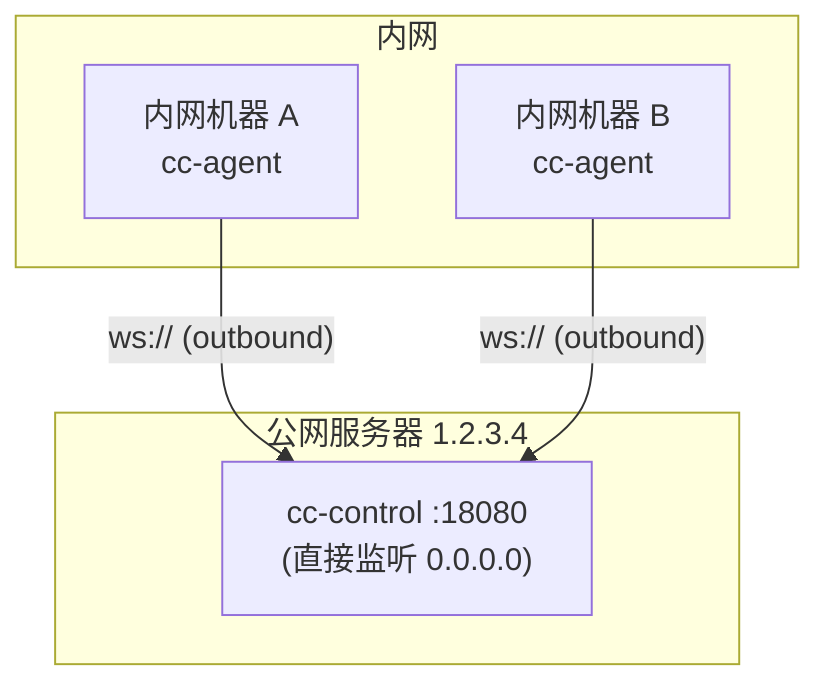
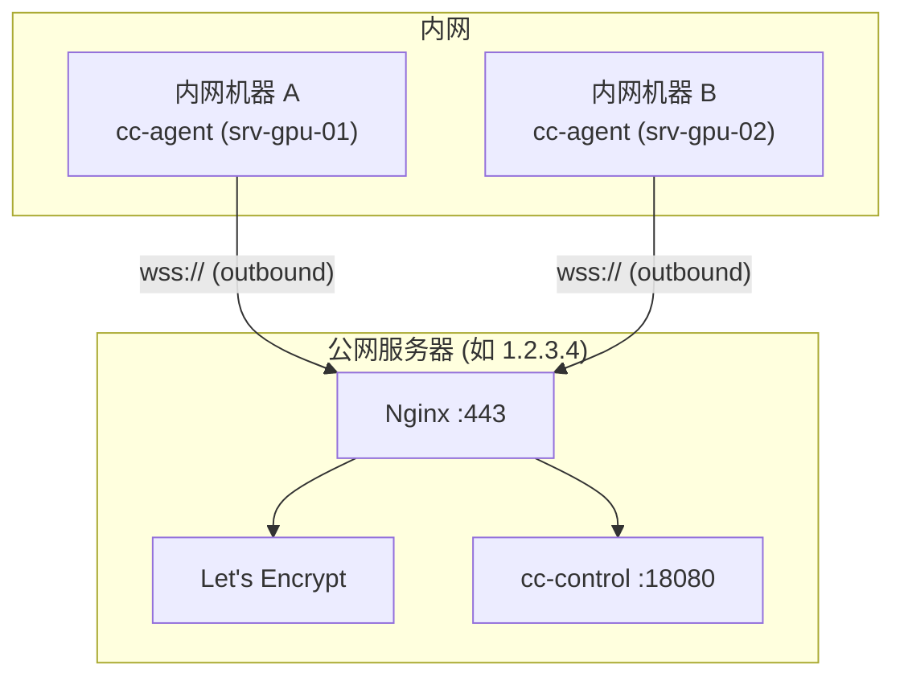

# 公网服务器部署方案

将 `cc-control` 部署到具有公网 IP 的服务器，`cc-agent` 部署到内网机器（可出站但无公网 IP）。
Agent 主动向 Control Plane 发起 WebSocket 出站连接，无需内网开放入站端口。

> 提示：文档中的可执行文件路径均为示例占位符，请替换为你自己的安装路径，不要在共享文档中暴露本机真实路径。

## 方案选择

| 方案 | 适用场景 | 需要 |
|------|---------|------|
| **方案 A：直连（无 TLS）** | 测试/内部网络/快速验证 | 仅公网 IP + 一个端口 |
| **方案 B：Nginx + TLS** | 生产环境 | 域名 + 证书 + 443 端口 |
| **方案 B'：Nginx + 自签名 TLS** | 无域名但要加密 | 公网 IP + 自签名证书 + 443 端口 |

---

## 方案 A：直连部署（无 Nginx、无 TLS）

cc-control 直接监听公网端口，agent 通过 `ws://` 明文连接。
**适合测试或对安全性要求不高的内网穿透场景。**

### 架构



### A.1 编译 & 上传

```bash
# 编译
cd cc-control
CGO_ENABLED=0 GOOS=linux GOARCH=amd64 go build -o cc-control ./cmd/cc-control
cd ../cc-agent
CGO_ENABLED=0 GOOS=linux GOARCH=amd64 go build -o cc-agent ./cmd/cc-agent

# 上传 control 到公网服务器
scp cc-control root@1.2.3.4:/opt/cc-control/
scp -r ../ui root@1.2.3.4:/opt/cc-control/ui
```

### A.2 生成 Token

```bash
ADMIN_TOKEN=$(openssl rand -hex 32)
echo "ADMIN_TOKEN=$ADMIN_TOKEN"
```

### A.3 公网服务器：启动 cc-control

关键区别：`-addr` 监听 `0.0.0.0:18080` 而非 `127.0.0.1`。

```bash
/opt/cc-control/cc-control \
  -addr 0.0.0.0:18080 \
  -ui-dir /opt/cc-control/ui \
  -admin-token "$ADMIN_TOKEN" \
  -audit-path /opt/cc-control/audit.jsonl \
  -offline-after-sec 30
```

Systemd 服务文件 `/etc/systemd/system/cc-control.service`：

```ini
[Unit]
Description=CC Control Plane
After=network.target

[Service]
Type=simple
User=cc
Group=cc
WorkingDirectory=/opt/cc-control
ExecStart=/opt/cc-control/cc-control \
  -addr 0.0.0.0:18080 \
  -ui-dir /opt/cc-control/ui \
  -admin-token ${ADMIN_TOKEN} \
  -audit-path /opt/cc-control/audit.jsonl \
  -offline-after-sec 30
EnvironmentFile=/opt/cc-control/.env
Restart=always
RestartSec=3

[Install]
WantedBy=multi-user.target
```

**可选**：若需 UI 上的 Pending Approvals（根据终端输出自动检测审批提示并弹出 Approve/Reject），在 `ExecStart` 中增加 `-enable-prompt-detection`；默认不开启，用户可直接在终端里输入 y/n 或 Enter/Esc 完成交互。

### A.3.1 生成 UI/Agent Token（Admin API）

```bash
# UI token（owner 角色），返回 tenant_id
curl -X POST http://1.2.3.4:18080/admin/tokens \
  -H "Authorization: Bearer $ADMIN_TOKEN" \
  -H "Content-Type: application/json" \
  -d '{"type":"ui","role":"owner"}'

# Agent token（绑定上一步 tenant_id）
curl -X POST http://1.2.3.4:18080/admin/tokens \
  -H "Authorization: Bearer $ADMIN_TOKEN" \
  -H "Content-Type: application/json" \
  -d '{"type":"agent","tenant_id":"<tenant_id>"}'
```

防火墙只放行该端口：

```bash
ufw allow 18080/tcp
ufw enable
```

### A.4 内网机器：启动 cc-agent

```bash
/opt/cc-agent/cc-agent \
  -control-url ws://1.2.3.4:18080/ws/agent \
  -agent-token "<agent-token>" \
  -server-id srv-gpu-01 \
  -allow-root /home/deploy/repos \
  -claude-path /path/to/ai-cli
```

Systemd 服务文件 `/etc/systemd/system/cc-agent.service`：

```ini
[Unit]
Description=CC Agent
After=network-online.target
Wants=network-online.target

[Service]
Type=simple
User=deploy
Group=deploy
WorkingDirectory=/opt/cc-agent
ExecStart=/opt/cc-agent/cc-agent \
  -control-url ws://1.2.3.4:18080/ws/agent \
  -agent-token ${AGENT_TOKEN} \
  -server-id ${SERVER_ID} \
  -allow-root /home/deploy/repos \
  -claude-path /path/to/ai-cli
EnvironmentFile=/opt/cc-agent/.env
Restart=always
RestartSec=5

[Install]
WantedBy=multi-user.target
```

`/opt/cc-agent/.env`（权限 600）：

```bash
AGENT_TOKEN=<agent-token-from-admin-api>
SERVER_ID=srv-gpu-01
```

可执行文件示例（按需选择其一）：

```bash
# OpenCode
-claude-path /path/to/opencode

# Codex
-claude-path /path/to/codex

# Gemini CLI
-claude-path /path/to/gemini
```

### A.5 验证

```bash
# 内网机器查看 agent 日志
journalctl -u cc-agent -f

# 浏览器访问
http://1.2.3.4:18080
# 输入 UI token 登录
```

### A.6 安全注意事项

无 TLS 意味着 token 和终端内容明文传输。可接受的前提：

- 仅用于测试/开发
- 或公网服务器与内网之间走 VPN / 专线
- 使用强随机 token（已被窃听者也无法猜测，但可被中间人截获）
- 可通过防火墙限制 18080 端口的源 IP 来收窄攻击面：

```bash
# 只允许特定内网出口 IP 连接
ufw allow from 203.0.113.50 to any port 18080
ufw allow from 198.51.100.10 to any port 18080
ufw deny 18080/tcp
```

---

## 方案 B：Nginx + TLS 部署（推荐生产使用）

### 架构



### B.1 编译 & 上传

```bash
cd cc-control
CGO_ENABLED=0 GOOS=linux GOARCH=amd64 go build -o cc-control ./cmd/cc-control

scp cc-control root@1.2.3.4:/opt/cc-control/
scp -r ../ui root@1.2.3.4:/opt/cc-control/ui
```

### B.2 生成 Token

```bash
ADMIN_TOKEN=$(openssl rand -hex 32)
echo "ADMIN_TOKEN=$ADMIN_TOKEN"
```

### B.3 cc-control Systemd 服务

`/etc/systemd/system/cc-control.service`：

```ini
[Unit]
Description=CC Control Plane
After=network.target

[Service]
Type=simple
User=cc
Group=cc
WorkingDirectory=/opt/cc-control
ExecStart=/opt/cc-control/cc-control \
  -addr 127.0.0.1:18080 \
  -ui-dir /opt/cc-control/ui \
  -admin-token ${ADMIN_TOKEN} \
  -audit-path /opt/cc-control/audit.jsonl \
  -offline-after-sec 30
EnvironmentFile=/opt/cc-control/.env
Restart=always
RestartSec=3

[Install]
WantedBy=multi-user.target
```

`/opt/cc-control/.env`（权限 600）：

```bash
ADMIN_TOKEN=<your-admin-token>
```

```bash
useradd -r -s /sbin/nologin cc
chown -R cc:cc /opt/cc-control
chmod 600 /opt/cc-control/.env
systemctl daemon-reload
systemctl enable --now cc-control
```

**可选**：若需 Pending Approvals 自动检测，在 `ExecStart` 中增加 `-enable-prompt-detection`（默认不开启）。

### B.3.1 生成 UI/Agent Token（Admin API）

```bash
# UI token（owner 角色），返回 tenant_id
curl -X POST https://cc.example.com/admin/tokens \
  -H "Authorization: Bearer $ADMIN_TOKEN" \
  -H "Content-Type: application/json" \
  -d '{"type":"ui","role":"owner"}'

# Agent token（绑定上一步 tenant_id）
curl -X POST https://cc.example.com/admin/tokens \
  -H "Authorization: Bearer $ADMIN_TOKEN" \
  -H "Content-Type: application/json" \
  -d '{"type":"agent","tenant_id":"<tenant_id>"}'
```

### B.4 Nginx 反向代理 + TLS

```bash
apt install -y nginx certbot python3-certbot-nginx
certbot --nginx -d cc.example.com
```

`/etc/nginx/conf.d/cc.conf`：

```nginx
server {
    listen 443 ssl http2;
    server_name cc.example.com;

    ssl_certificate     /etc/letsencrypt/live/cc.example.com/fullchain.pem;
    ssl_certificate_key /etc/letsencrypt/live/cc.example.com/privkey.pem;

    # WebSocket: agent 连接
    location /ws/ {
        proxy_pass http://127.0.0.1:18080;
        proxy_http_version 1.1;
        proxy_set_header Upgrade $http_upgrade;
        proxy_set_header Connection "upgrade";
        proxy_set_header Host $host;
        proxy_set_header X-Real-IP $remote_addr;
        proxy_read_timeout 3600s;
        proxy_send_timeout 3600s;
    }

    # REST API + 静态 UI
    location / {
        proxy_pass http://127.0.0.1:18080;
        proxy_set_header Host $host;
        proxy_set_header X-Real-IP $remote_addr;
    }
}

server {
    listen 80;
    server_name cc.example.com;
    return 301 https://$host$request_uri;
}
```

```bash
nginx -t && systemctl reload nginx
ufw allow 80/tcp
ufw allow 443/tcp
ufw enable
```

### B.5 内网机器：cc-agent

编译并分发：

```bash
cd cc-agent
CGO_ENABLED=0 GOOS=linux GOARCH=amd64 go build -o cc-agent ./cmd/cc-agent
scp cc-agent user@internal-host:/opt/cc-agent/
```

`/etc/systemd/system/cc-agent.service`：

```ini
[Unit]
Description=CC Agent
After=network-online.target
Wants=network-online.target

[Service]
Type=simple
User=deploy
Group=deploy
WorkingDirectory=/opt/cc-agent
ExecStart=/opt/cc-agent/cc-agent \
  -control-url wss://cc.example.com/ws/agent \
  -agent-token ${AGENT_TOKEN} \
  -server-id ${SERVER_ID} \
  -allow-root /home/deploy/repos \
  -claude-path /path/to/ai-cli
EnvironmentFile=/opt/cc-agent/.env
Restart=always
RestartSec=5

[Install]
WantedBy=multi-user.target
```

`/opt/cc-agent/.env`（权限 600）：

```bash
AGENT_TOKEN=<agent-token-from-admin-api>
SERVER_ID=srv-gpu-01
```

```bash
chmod 600 /opt/cc-agent/.env
systemctl daemon-reload
systemctl enable --now cc-agent
```

### B.6 验证

```bash
journalctl -u cc-agent -f
# 浏览器: https://cc.example.com  用 UI token 登录
```

---

## 方案 B'：无域名 + 自签名 TLS

无域名时无法使用 Let's Encrypt，可用自签名证书在 Nginx 上启用 TLS，传输仍加密；浏览器和 agent 需接受自签名（浏览器手动信任，agent 用 `-tls-skip-verify`）。

### B'.1 生成自签名证书（含 IP SAN）

将 `1.2.3.4` 换成公网服务器 IP。

```bash
mkdir -p /opt/cc-control/tls
cd /opt/cc-control/tls

# openssl 配置文件：证书包含 IP
cat > openssl.cnf << 'EOF'
[req]
distinguished_name = req_distinguished_name
req_extensions = v3_req
prompt = no
[req_distinguished_name]
CN = cc-control
[v3_req]
subjectAltName = @alt
[alt]
IP.1 = 1.2.3.4
EOF

openssl req -x509 -nodes -days 3650 -newkey rsa:2048 \
  -keyout key.pem -out cert.pem -config openssl.cnf -extensions v3_req
```

### B'.2 cc-control 与 B 相同

与方案 B 的 B.1～B.3 一致：cc-control 监听 `127.0.0.1:18080`，由 Nginx 反向代理（使用 `-admin-token`）。可选参数（如 `-enable-prompt-detection`）同 B.3。

### B'.3 Nginx 使用自签名证书

不装 certbot，直接配置 Nginx 使用上面生成的证书。

`/etc/nginx/conf.d/cc.conf`：

```nginx
server {
    listen 443 ssl http2 default_server;
    listen [::]:443 ssl http2 default_server;
    server_name _;

    ssl_certificate     /opt/cc-control/tls/cert.pem;
    ssl_certificate_key /opt/cc-control/tls/key.pem;

    location /ws/ {
        proxy_pass http://127.0.0.1:18080;
        proxy_http_version 1.1;
        proxy_set_header Upgrade $http_upgrade;
        proxy_set_header Connection "upgrade";
        proxy_set_header Host $host;
        proxy_set_header X-Real-IP $remote_addr;
        proxy_read_timeout 3600s;
        proxy_send_timeout 3600s;
    }

    location / {
        proxy_pass http://127.0.0.1:18080;
        proxy_set_header Host $host;
        proxy_set_header X-Real-IP $remote_addr;
    }
}
```

```bash
nginx -t && systemctl reload nginx
ufw allow 443/tcp
ufw enable
```

### B'.4 内网机器：cc-agent（启用 -tls-skip-verify）

自签名证书无法通过系统 CA 校验，agent 需加 `-tls-skip-verify`（或环境变量 `TLS_SKIP_VERIFY=1`）。

```bash
/opt/cc-agent/cc-agent \
  -control-url wss://1.2.3.4/ws/agent \
  -tls-skip-verify \
  -agent-token "<agent-token>" \
  -server-id srv-gpu-01 \
  -allow-root /home/deploy/repos \
  -claude-path /path/to/ai-cli
```

Systemd 示例：

```ini
ExecStart=/opt/cc-agent/cc-agent \
  -control-url wss://1.2.3.4/ws/agent \
  -tls-skip-verify \
  -agent-token ${AGENT_TOKEN} \
  -server-id ${SERVER_ID} \
  ...
```

也可在 `/opt/cc-agent/.env` 中设 `TLS_SKIP_VERIFY=1`，则 ExecStart 可不写 `-tls-skip-verify`。

### B'.5 验证

- 浏览器访问 `https://1.2.3.4`，会提示证书不受信任，手动「继续访问」后用 UI token 登录。
- 内网机器：`journalctl -u cc-agent -f` 确认连接成功。

**注意**：`-tls-skip-verify` 仅适用于受控环境（如自签名或内网）。在公网对不可信服务器不要开启，以免中间人攻击。

---

## 2. 客户端连接

部署完成后，用户通过以下方式连接中心化 Control Plane：

### 2.1 macOS 原生客户端

`app/AgentControlMac` 提供 SwiftUI 原生应用，可连接任意已部署的 cc-control。

1. 打开应用，按 **Cmd+,** 进入 Settings
2. 填写：
   - **Base URL**：根据部署方案选择
     - 方案 A：`http://公网IP:18080`（如 `http://1.2.3.4:18080`）
     - 方案 B：`https://域名`（如 `https://cc.example.com`）
     - 方案 B'：`https://公网IP`，必须勾选 **Skip TLS verification**（macOS 无证书信任弹窗，需在客户端跳过校验）
   - **UI Token**：由 Admin API 生成的 UI token
3. 点击 **Save & Reconnect**

详细说明见 [app/AgentControlMac/README.md](../app/AgentControlMac/README.md)。

### 2.2 浏览器

- 方案 A：`http://公网IP:18080`，输入 UI token 登录
- 方案 B：`https://域名`，输入 UI token 登录
- 方案 B'：`https://公网IP`，先接受自签名证书警告，再输入 UI token

---

## 3. 安全加固清单

| 项目 | 方案 A (无 TLS) | 方案 B (域名 TLS) | 方案 B' (自签名 TLS) |
|------|----------------|-------------------|----------------------|
| 传输加密 | 无，token 明文 | TLS 加密 | TLS 加密 |
| Token | 强随机，防火墙限源 IP | 强随机即可 | 强随机即可 |
| allow-root | 严格限制到项目目录 | 同左 | 同左 |
| 运行用户 | 非 root | 同左 | 同左 |
| 端口暴露 | 防火墙限源 IP | 仅 80/443 | 仅 443 |
| UI 访问限制 | 防火墙限源 IP | Nginx IP 白名单 / Basic Auth | 同左 |
| 日志审计 | `audit.jsonl` 定期归档 | 同左 | 同左 |
| 证书 | — | Let's Encrypt | 自签名，agent 用 `-tls-skip-verify` |

## 4. 多 Agent 批量部署（可选）

用同一份二进制 + 不同 `.env` 即可。每台机器只需改 `SERVER_ID`：

```bash
# 批量分发示例
for host in gpu01 gpu02 gpu03; do
  scp cc-agent $host:/opt/cc-agent/
  ssh $host "cat > /opt/cc-agent/.env << EOF
AGENT_TOKEN=<agent-token-from-admin-api>
SERVER_ID=srv-$host
EOF
chmod 600 /opt/cc-agent/.env
systemctl daemon-reload
systemctl enable --now cc-agent"
done
```

## 5. 旧版本破坏性升级（legacy token -> admin token）

适用于旧部署仍使用 `-ui-token/-agent-token`，且你接受短暂中断与 token 轮换。

### 5.1 备份当前运行文件

```bash
TS=$(date +%Y%m%d-%H%M%S)
mkdir -p ~/cc-upgrade-backup/$TS
sudo cp /opt/cc-control/cc-control ~/cc-upgrade-backup/$TS/cc-control.bin.bak
sudo cp /etc/systemd/system/cc-control.service ~/cc-upgrade-backup/$TS/cc-control.service.bak
sudo cp /opt/cc-control/.env ~/cc-upgrade-backup/$TS/cc-control.env.bak
```

### 5.2 升级二进制并切换到 admin-token 启动

`/etc/systemd/system/cc-control.service` 的核心参数建议切到：

```ini
ExecStart=/opt/cc-control/cc-control \
  -addr 127.0.0.1:18080 \
  -ui-dir /opt/cc-control/ui \
  -admin-token ${ADMIN_TOKEN} \
  -audit-path /opt/cc-control/audit.jsonl \
  -offline-after-sec 30
```

`/opt/cc-control/.env`：

```bash
ADMIN_TOKEN=<your-admin-token>
```

重启：

```bash
sudo systemctl daemon-reload
sudo systemctl reset-failed cc-control || true
sudo systemctl restart cc-control
curl -sS http://127.0.0.1:18080/api/healthz
```

### 5.3 签发新 UI/Agent Token

```bash
# 先创建 UI token 并记下 tenant_id
curl -X POST https://<control-host>/admin/tokens \
  -H "Authorization: Bearer $ADMIN_TOKEN" \
  -H "Content-Type: application/json" \
  -d '{"type":"ui","role":"owner"}'

# 再为同 tenant_id 创建 Agent token
curl -X POST https://<control-host>/admin/tokens \
  -H "Authorization: Bearer $ADMIN_TOKEN" \
  -H "Content-Type: application/json" \
  -d '{"type":"agent","tenant_id":"<tenant_id>"}'
```

说明：
- Admin API 签发的 token 为内存态，`cc-control` 重启后需重新签发或外部持久化管理。
- 切换后如果看到 `/api/servers` 为空，通常是 agent 还在用旧 token。

### 5.4 逐台重启 agent（使用新 Agent token）

```bash
/opt/cc-agent/cc-agent \
  -control-url wss://<control-host>/ws/agent \
  -agent-token "<new-agent-token>" \
  -server-id srv-gpu-01 \
  -allow-root /home/deploy/repos \
  -claude-path /path/to/ai-cli
```

若是自签名 TLS，加 `-tls-skip-verify`。

### 5.5 回滚（可选）

```bash
TS=<backup-ts>
sudo cp ~/cc-upgrade-backup/$TS/cc-control.bin.bak /opt/cc-control/cc-control
sudo cp ~/cc-upgrade-backup/$TS/cc-control.service.bak /etc/systemd/system/cc-control.service
sudo cp ~/cc-upgrade-backup/$TS/cc-control.env.bak /opt/cc-control/.env
sudo systemctl daemon-reload
sudo systemctl restart cc-control
```

## 6. 故障排查

```bash
# 检查 control 是否在监听
ss -tlnp | grep 18080

# 检查 agent WebSocket 连接
journalctl -u cc-agent --since "5 min ago"

# 检查 nginx 代理
curl -v https://cc.example.com/api/servers

# 检查防火墙
ufw status
```
