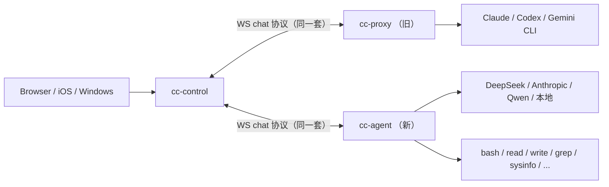

# v0.7.0 版本说明：自研 cc-agent 上线

发布日期：2026-05-08
GitHub Release: <https://github.com/xuzhougeng/agent-control/releases/tag/v0.7.0>

## 一句话总结

新增独立模块 **`cc-agent`**——一个用 Go 写、可独立部署到服务器的 server-ops AI agent。
原来对接 Claude/Codex/Gemini CLI 的 `cc-agent` 模块改名为 **`cc-proxy`**，职责（PTY 代理）不变。
两者通过同一套 cc-control 协议接入，UI 上自动区分。

## 为什么做这次重构

旧 `cc-agent` 是 PTY 代理，所有"思考"都发生在外部 CLI（Claude Code 等）里。
我们想要：

- 部署到生产服务器做运维时，**完全自主**的 agent 链路（不依赖外部 CLI）
- **更可控** 的工具集和审批语义（destructive 命令拦截）
- **多 LLM provider** 支持（Anthropic / DeepSeek / Qwen / 本地模型）
- 跟现有 cc-control + Web/iOS/Windows UI **零成本兼容**

新 `cc-agent` 是一个从零写的 Go agent：自己跑 ReAct 循环，调用工具，记历史，蒸馏 skill。

> 设计灵感来自开源项目 [GenericAgent](https://github.com/lsdefine/GenericAgent)（agent loop + skill tree + reflect）和 [EvoMaster](https://github.com/sjtu-sai-agents/EvoMaster)（演化型 framework 形态）。具体致谢见 [`cc-agent/README.md`](../cc-agent/README.md#acknowledgments) 末尾的 Acknowledgments。

## 重要变化（**含一处不兼容改名**）

### ⚠️ `cc-agent` 二进制从 v0.7.0 起变成新模块

| 旧版本（≤ v0.6.x） | v0.7.0 起 |
|---|---|
| `cc-agent` 二进制 = PTY 代理（包 Claude Code 等 CLI） | `cc-proxy` 二进制 = PTY 代理（功能不变，只改名） |
| 不存在 | `cc-agent` 二进制 = 自研 server-ops agent |

如果你之前在脚本 / systemd unit / 镜像里写死了 `cc-agent` 命令行，**升级前先换成 `cc-proxy`**。
模块路径、cmd 路径、scripts 目录已同步重命名：

```
cc-agent/                  →  cc-proxy/
cc-agent/cmd/cc-agent      →  cc-proxy/cmd/cc-proxy
scripts/cc-agent/          →  scripts/cc-proxy/
```

cc-control、cc-web 与 cc-proxy 之间的 WS 协议**完全不变**，无需改动。

### 新模块 `cc-agent`：能做什么

新 `cc-agent` 是 PTY 代理之外的另一种 agent 形态：



控制面、UI 不挑后端类型；同一个 chat 会话，无论后端是 cc-proxy 还是 cc-agent，操作体验一致。

## 主要新功能

### 1. 多 LLM Provider 抽象

支持以下 provider：

| Provider | 默认模型 | 备注 |
|---|---|---|
| `anthropic` | `claude-sonnet-4-6` | 原生 Messages API + tool_use |
| `openai` | `gpt-4o-mini` | OpenAI Chat Completions |
| `deepseek` | `deepseek-chat` | OpenAI 兼容；支持 `deepseek-v4-pro` 的 thinking 模式 |
| `qwen` | `qwen-plus` | OpenAI 兼容（DashScope 兼容入口） |
| `openai-compat` | 自定义 | 任意 vLLM / Ollama / llama.cpp |

通过 env 切换：

```bash
export CC_AGENT_PROVIDER=deepseek
export CC_AGENT_MODEL=deepseek-chat
export CC_AGENT_BASE_URL=https://api.deepseek.com
export CC_AGENT_API_KEY=sk-...
```

**reasoning_content 自动回传**：DeepSeek `deepseek-v4-pro` 等 thinking 模型在响应里带 `reasoning_content` 字段，cc-agent 自动捕获并在下一轮回传，思维链跨工具调用保持一致。

### 2. 内置运维工具集

注册到 `tools.DefaultRegistry` 的 8 个工具：

| 工具 | 用途 |
|---|---|
| `bash` | 执行 shell 命令（cwd 固定、超时上限） |
| `read` | 读文本文件（支持 offset/limit 行窗口、`allowed_roots` 路径包含校验） |
| `write` | 写文件（默认禁止覆盖；`overwrite=true` 才允许） |
| `grep` | RE2 正则在目录树搜索 |
| `glob` | 按 glob pattern 列文件 |
| `sysinfo` | uname / uptime / 内存 / 磁盘 / 负载快照 |
| `proclist` | 按 RSS 排序的 top 进程 |
| `logtail` | tail -n 日志最后 N 行 |

要扩展自己的工具，实现 `tools.Tool` 接口注册即可，~30 行代码。

### 3. 危险命令审批闸（Approval Gate）

bash 工具内置 18 条危险模式正则（`rm -rf` / `mkfs` / `dd of=/dev/sd*` / `shutdown` / `systemctl stop|disable|mask` / `kill -9` / fork bomb / `git push --force` / ...）。命中时调 Approver。

三种模式（启动 flag）：

| Flag | 行为 |
|---|---|
| 默认（CLI 模式） | 终端 stderr 提示 + 等待 `[y/N]` 输入 |
| `-full-permission` | yolo 模式，跳过所有提示直接执行 |
| `-deny-destructive` | 静默拒绝（cc-control 桥 / cron / 后台脚本默认推荐） |

被拒绝时模型会收到 `DENIED by operator: <reason>` 字符串作为工具结果，**会自然降级到更安全的方案**（不抛错，让 ReAct 循环自己处理）。

### 4. ReAct 主循环 + 持久化

- 每个用户 turn：模型 → 工具调用 → 工具结果 → 模型 → ...，直到 `end_turn` 或达到 `MaxIterations`（默认 12）
- session 历史可持久化到 SQLite (`-memory ~/.cc-agent/sessions.db`)，重启后用同一个 `-session <id>` 接续

### 5. Skills + 自演化（`:reflect`）

Skill 是一份 JSON 配方：包含 system prompt 片段 + 工具白名单 + 示例 user request。

```json
{
  "name": "nginx-triage",
  "description": "Triage common nginx issues",
  "prompt": "Focus on access.log/error.log under /var/log/nginx; suspect 5xx first.",
  "tools": ["bash", "read", "grep", "logtail"]
}
```

**自演化**：在 REPL 里运维一次成功后，输入 `:reflect <name>` 命令，cc-agent 把这次 session 的 transcript 喂给 LLM 蒸馏成一份新 skill JSON，写到 `skills_dir/`：

```
you> 用 bash 跑 uname -r 告诉我内核版本
[模型调 bash, 拿到 6.6.87.2]
you> :reflect kernel-probe Identify the running kernel
distilling session into skill...
✓ saved skill kernel-probe -> /etc/cc-agent/skills.d/kernel-probe.json
  description: Identify the running kernel
  tools: bash
  examples:
    - What kernel version am I running?
    - Show me only the kernel release string.
```

下次启动加载同一个 `-skills-dir`，新 skill 自动可用。

REPL slash 命令：

| 命令 | 作用 |
|---|---|
| `:help` | 列出所有命令 |
| `:skills` | 列已加载 skill |
| `:reflect <name> [description]` | 蒸馏当前 session 为新 skill |

### 6. cc-control WS 桥（chat-mode）

加 `-control-url` flag，cc-agent 注册到现有 cc-control 控制面：

```bash
./cc-agent \
  -provider deepseek -model deepseek-chat \
  -cwd /var/log -allowed-roots /var/log \
  -control-url ws://your-control:18180/ws/agent \
  -agent-token <agent-token> \
  -server-id ops-01 \
  -deny-destructive
```

带 `-control-url`（或 `-http`）时进程进入 daemon 模式：跳过 REPL，等 SIGINT/SIGTERM。
**只支持 chat 模式**（PTY 留给 cc-proxy）；收到 `start_session` 显式拒绝。

### 7. 步级流式输出（Step-Level Streaming）

cc-agent 处理一个用户消息时，每个工具步骤会立即推一个进度气泡到 UI（不等整段答案）：

| Bubble 类型 | meta 字段 | UI 表现 |
|---|---|---|
| 进度气泡 | `progress: true` | 浅色 `.progress` 样式 |
| 进度气泡 | `progress: true`（每个 tool_use / tool_result）| `▶ bash {command=...}` / `✓ exit_code: 0 ...` |
| 最终气泡 | `final: true`、附 `operations` 数组 | 实色，带 INTERMEDIATE STEPS 折叠区 |

复用 cc-proxy 的 `claude-stream-json` meta 约定，**前端零改动**生效。
chat-claude worker 的 progress 渲染逻辑也同样适用。

### 8. 三端 UI 自动识别 cc-agent

cc-web、iOS、Windows 三端服务器列表卡片现在会显示一个紫色 **`cc-agent`** 徽章，标识使用新 agent 运行时（vs 旧 cc-proxy）。
判定逻辑：tags 包含 `"cc-agent"`，或 `claude_path == "cc-agent-builtin"`。

## 升级指南

### 已有 v0.6.x 部署

1. **重命名 systemd unit / 启动脚本里的 cc-agent → cc-proxy**：旧二进制功能不变，只是名字变了。
2. 拉新二进制（cc-control 不需要重启，协议未变）：
   ```bash
   wget -O cc-proxy https://github.com/xuzhougeng/agent-control/releases/download/v0.7.0/cc-proxy-linux-amd64
   chmod +x cc-proxy
   # 把原来的 cc-agent 命令换成 ./cc-proxy（参数完全相同）
   ```
3. cc-control + cc-web 升级到 v0.7.0 以拿到 cc-agent 徽章渲染。

### 想新加自研 cc-agent 节点

1. 下载 `cc-agent-linux-amd64`：
   ```bash
   wget -O cc-agent https://github.com/xuzhougeng/agent-control/releases/download/v0.7.0/cc-agent-linux-amd64
   chmod +x cc-agent
   ```
2. 配 LLM key（推荐 DeepSeek，便宜稳）：
   ```bash
   echo 'sk-xxx' > ~/.cc-agent-key && chmod 600 ~/.cc-agent-key
   ```
3. 接到 cc-control（先在 admin 页签发 agent token）：
   ```bash
   CC_AGENT_API_KEY="$(cat ~/.cc-agent-key)" \
   CC_AGENT_BASE_URL=https://api.deepseek.com \
   ./cc-agent -provider deepseek -model deepseek-chat \
     -cwd /var/log -allowed-roots /var/log \
     -control-url ws://control.example.com:18180/ws/agent \
     -agent-token <agent-token> \
     -server-id ops-01 \
     -memory /var/lib/cc-agent/sessions.db \
     -skills-dir /etc/cc-agent/skills.d \
     -deny-destructive
   ```
4. 浏览器打开 cc-control，server 列表里 ops-01 会带紫色 `cc-agent` 徽章。

### 想本地试一下

不需要 cc-control，直接 REPL：

```bash
CC_AGENT_API_KEY="$(cat ~/.cc-agent-key)" \
CC_AGENT_BASE_URL=https://api.deepseek.com \
./cc-agent -provider deepseek -model deepseek-chat -cwd /tmp
# 进入 REPL，输入运维问题；:help 看 slash 命令
```

## 已知 caveat

- **DeepSeek `deepseek-v4-pro` 在 thinking 模式下单 turn 可能跑 1–3 分钟**。建议：
  - 简单运维查询用 `deepseek-chat`（V3，无 thinking，几秒到 30 秒）
  - 复杂决策性任务再用 v4-pro
  - cc-agent 的 HTTP client 默认 300s 超时，足够 thinking 模式跑完
- **小模型（7B 以下）的 tool calling 准确率不稳**。本地用 Ollama 时建议 14B 起步。
- **cc-web 的进度气泡**复用 `claude-stream-json` meta 约定，每个 tool 步骤是独立 bubble。这不是字符级 token streaming（roadmap 上的"true SSE token streaming"是后续工作）。
- **审批闸只覆盖 bash 工具**。文件写入（write）也算敏感操作但当前不走审批；后续考虑加。

## 文件 / 代码体量

```
cc-agent/  4,303 LOC, 30 个 .go 文件, 23 个单元测试 + 1 个 WS 端到端测试
cc-proxy/  3,557 LOC（重命名自旧 cc-agent）, 27 个 .go 文件
cc-control/ 不变
cc-web/    新增 ~30 行 server-list / admin badge + CSS
app/AgentControlMac / app/AgentControlWin/   各加几十行 badge 渲染
```

二进制：`cc-agent` 10.9MB，`cc-proxy` 类似，`cc-control` 15.4MB。全部 CGO_ENABLED=0 + stripped，纯 Go 静态二进制。

## 下一步路线图

- [ ] 真正的 token-level SSE 流（前端要改：按 message_id dedup 同一气泡的多次 delta 更新）
- [ ] 审批 webhook（HTTP / cc-control 模式下推到 Slack/Email 等待人审）
- [ ] Multi-agent 协调（coordinator 拆解任务 → 派发给 specialist sub-agent）
- [ ] Auto-reflect 启发式（高频成功任务自动蒸馏 skill）
- [ ] 审批 audit trail（写 JSONL 持久化）
- [ ] Per-skill 模型 override（log triage 跑本地 Qwen，复杂决策跑 Claude）
- [ ] Tool sandboxing（namespace/jail 跑 bash）
- [ ] Memory compaction（超过阈值自动总结早期 turn）
- [ ] cc-control 跨重启的 chat session 自动恢复

完整列表见 [`cc-agent/README.md`](../cc-agent/README.md#roadmap) 的 Roadmap 节。

---

返回 [文档索引](README.md) · [项目根 README](../README.md)
